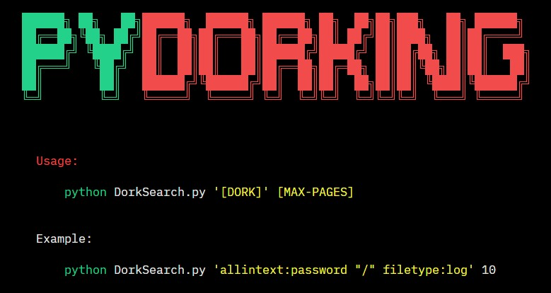
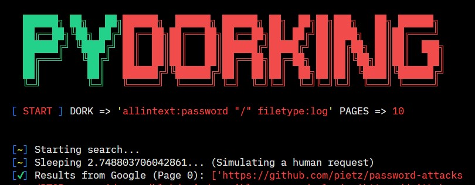

<h2 style="text-align:center; color:red;">DISCLAIMER</h2>

<strong style="color:red;">MGNG13</strong> and <strong><a href="https://github.com/AlisamTechnology/ATSCAN" style="color:red;">Alisam Technology</a></strong> is not responsible for any misuse, damage caused by this script or attacking targets without prior mutual consent! It is your responsibility to obey laws!

<h3 style="text-align:center; color:yellow;">WARNING: Use of this GitHub Repository</h3>

This repository is provided as-is, without any warranties or guarantees of any kind, expressed or implied. By accessing or utilizing any content, code, or resources within this repository, you acknowledge and accept that you do so at your own risk.

I hereby declare that I am not responsible for any misuse, damage, or adverse effects resulting from the use, misuse, or misinterpretation of any materials contained within this repository. This includes, but is not limited to, any loss of data, system failures, security breaches, or legal repercussions.

It is your responsibility to thoroughly review, understand, and assess the suitability and safety of any code, scripts, or instructions provided within this repository before implementing them in any environment, system, or project. You should exercise caution and discretion when utilizing any resources provided herein.

Furthermore, I disclaim any liability for the actions or consequences of third parties who may access or utilize this repository. Any reliance you place on the information or materials within this repository is strictly at your own risk.

By accessing or using this repository, you agree to indemnify and hold harmless the owner and contributors against any claims, damages, losses, or liabilities arising from your use or misuse of this repository.

If you do not agree with these terms, or if you are unsure about the implications of using this repository, refrain from accessing or utilizing any content contained herein.

Proceed with caution, and always prioritize safety, security, and compliance with applicable laws and regulations.

**Note**: This disclaimer applies to the entirety of this GitHub repository and all its contents, including but not limited to code, documentation, configurations, and any other resources provided.

<h4>References</h4>

- **AlisamTechnology (SearchEngine)**
    https://github.com/AlisamTechnology/ATSCAN